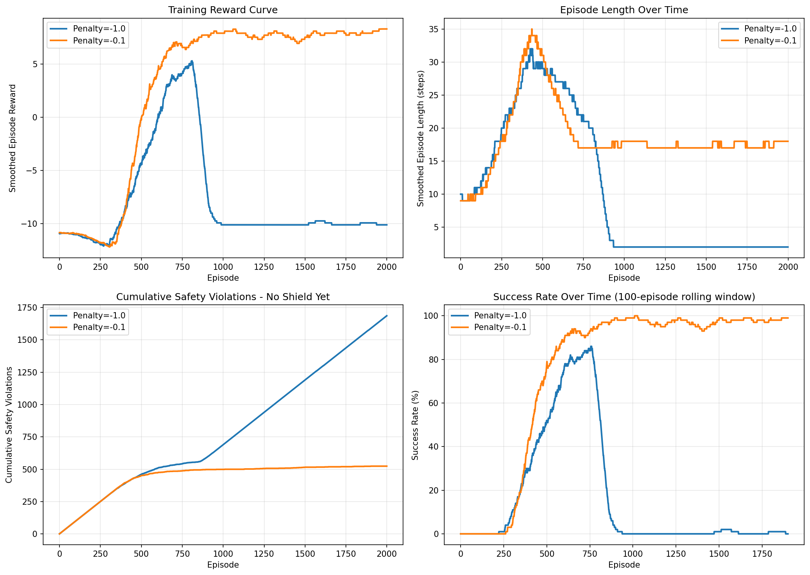
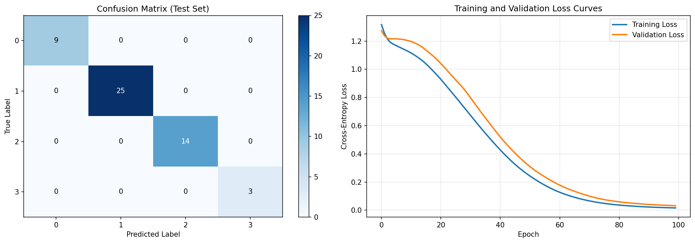
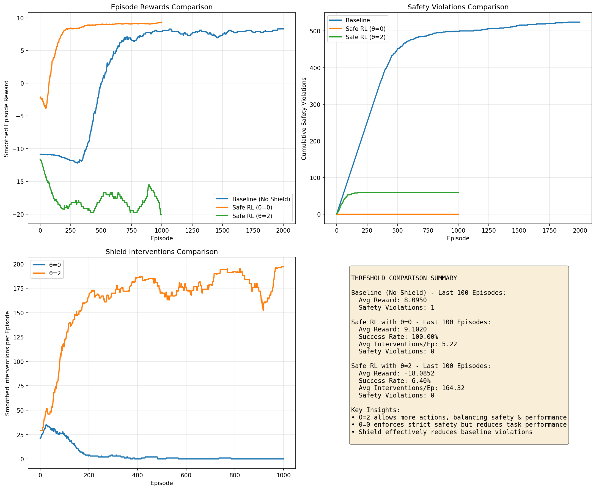

# Safe Reinforcement Learning with Shielding

Implements a Safety Shield for a reinforcement learning agent to prevent it from taking unsafe actions during training and deployment. Combines Q-learning with a neural-network safety classifier that intervenes when the agent's intended action violates safety constraints.

## Overview

Standard RL agents can explore dangerous states during learning. This project implements the **shielding** paradigm: a safety monitor sits between the agent and the environment, blocking any action the shield classifies as unsafe and substituting a safe alternative. The approach is evaluated on a 10x10 gridworld environment with 15 hazard cells.

## Tech Stack

- **Language:** Python 3
- **Libraries:** TensorFlow/Keras, NumPy, scikit-learn, SciPy, matplotlib, pickle
- **Environment:** Jupyter Notebook

## Key Concepts

- Q-learning and tabular Q-table (`baseline_qtable.pkl`)
- Safety constraint specification and dataset collection
- Neural network safety classifier (`shield_model.keras`)
- Shield intervention: action blocking and safe-action substitution
- Comparison of unsafe vs. shielded agent trajectories
- Visualisation of safety violations and constraint satisfaction

## Project Structure

```
ai-safe-reinforcement-learning-shield/
├── safe_rl_shield.ipynb       # Main notebook
├── baseline_qtable.pkl        # Pre-trained Q-table
├── complete_dataset.pkl       # Full training dataset
├── safety_dataset.pkl         # Safety-labelled transitions
├── shield_model.keras         # Trained safety shield network
├── experiment_2_results.png   # Task 2 results
├── experiment_4_results.png   # Task 4 results
└── experiment_5_results.png   # Task 5 results
```

## How to Run

```bash
pip install tensorflow numpy scikit-learn scipy matplotlib jupyter
jupyter notebook safe_rl_shield.ipynb
```

Developed and tested with Python 3.9+. There is no `requirements.txt` in this repo — install the packages above directly.

## Experiments

| Experiment | Description |
|------------|-------------|
| Exp 1 | Implement and train baseline Q-learning agent |
| Exp 2 | Collect safety-labelled transition dataset |
| Exp 3 | Train neural network safety shield classifier |
| Exp 4 | Integrate shield with RL agent — block unsafe actions |
| Exp 5 | Evaluate and compare shielded vs. unshielded performance |

## Results

**Exp 1/2 — Baseline Q-learning, step-penalty comparison** (2000 episodes each):

| Metric | Config 1 (penalty=-1.0) | Config 2 (penalty=-0.1) |
|---|---|---|
| Success rate | 0.60% | 98.2% |
| Avg reward | -9.9904 | 7.9410 |
| Avg episode length | 2.104 | 17.99 |
| Total safety violations | 1686 | 524 |



**Exp 2 — Safety dataset**: 336 state-action samples generated over the 10x10 (100-state) danger map, 10-dim feature vectors, 4 risk classes (17.6% / 47.9% / 28.0% / 6.5%). Split 234 train / 51 val / 51 test (70/15/15).

**Exp 3/4 — Safety shield classifier** (64-64-4 dense network, 5,124 params), evaluated on the 51-sample test set:

- Overall accuracy: **100.00%**
- Test loss: **0.0322**
- Per-class accuracy: 100.00% on all 4 risk classes
- Confusion matrix: perfectly diagonal, `[[9,0,0,0],[0,25,0,0],[0,0,14,0],[0,0,0,3]]`



**Exp 5 — Shielded vs. unshielded RL** (metrics averaged over the last 100 episodes of training):

| Metric | Baseline (no shield) | Shield θ=0 | Shield θ=2 |
|---|---|---|---|
| Avg episode reward | 8.0950 | 9.1020 | -18.0852 |
| Success rate | 0% | 100.00% | 6.40% |
| Avg episode length | 0 | 9.98 | 187.32 |
| Avg interventions/episode | 0 | 5.22 | 164.32 |
| Safety violations (last 100 episodes) | 1 | 0 | 0 |



Open the notebook and run cells in order — each stage builds on outputs (and saved `.pkl`/`.keras` files) from the previous one.
